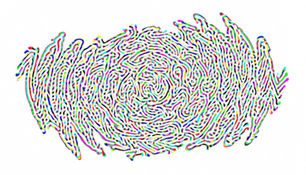
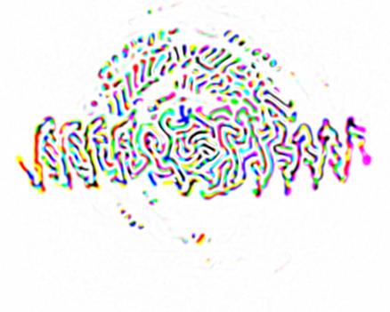
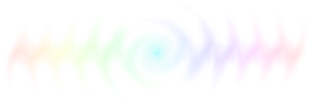
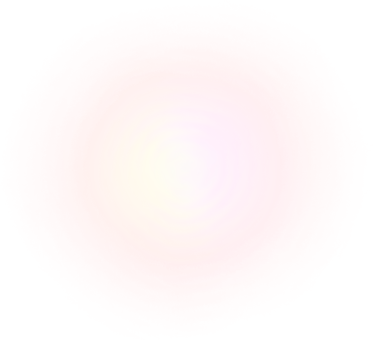

# *Turning into Turing*, A Rotational Growth Photoshop® Script

## How did this, become this, become that?

Did you know that if you repeatedly rotate an image in Photoshop®, it eventually breaks down and may produce a Turing pattern that animates differential growth?

> ***The start:** HSB gradient (hue = 0–360, s = 100, b = 100), 361 × 2 px*
> 
> 

> ***And then:** the above image rotated by 2 degrees, 360 times (a.k.a 2 full revolutions)*
> 
> 

> ***But THEN:** the start image rotated by 2 degrees, 10800 times (a.k.a 60 full revolutions)*
> 
> 

It may be hard to believe, but the ***only*** thing I did was rotate the first image thousands of times. See it as an animation:

---

## How to

The `jsx` file will only work in Photoshop®.

It’s generally good to have a canvas that’s bigger than the image you want to alter, but you can always change that later too. You’ll also probably want to save the file as `Large Document Format` (.psb) before you begin as the file size gets real big, real fast.

- Select a layer to apply the script to.
- Go to `File` menu, choose `Scripts`, then `Browse…` and select the `rotational_growth.jsx` file
- You will be prompted to input the settings you would like to use:
    - Interpolation method. The first three produce Turing patterns, the last two don’t
    - Anchor point location. Best to keep in center in most cases
    - Number of steps per rotation, e.g. `72 steps` = `5°`. Integers only
    - Number of total revolutions. Integers only
    - Number of revolutions to show every frame / iteration. Zero will only show every 360° revolution frame
    - Whether you want it rotate counter-clockwise or not.
- The window should show you the number of rotation iterations and new lyers that will be created in the file. I'd keep these low until you understand how long the script can take.
- Sit back and wait 🍸

---

## Examples of settings:

### Interpolation (2 degrees: 2 revolutions & 60 revolutions):

> **bicubic**
>
> 
>
> 

> **bicubicSharper**
>
> 
>
> 
>
> the best IMHO

> **bicubicSmoother**
>
> 
>
> 

> **bilineer**
>
> 
>
> 

> **nearestNeighbor**
>
> 
>
> 

---

### Caveats:

- Rotating by 1, 2, or 4 steps will produce no real results as rotating by 360°, 180°, or 90° are lossless transformations
- a single pixel, or very small amounts of pixels may not produce any real results
- large numbers of steps (i.e. very small degrees per step) may also not produce results
- large numbers of steps will take forever, as will large numbers of revolutions
- Photoshop will hang, quit, or otherwise be unresponsive. It will hate you.
- I’m pretty sure if an app / library uses bicubic interpolation, similar results can be had with repeated rotations

### Related / Research / etc.:

- Helmut Dersch’s [Testing Interpolator Quality](https://www.panotools.org/dersch/interpolator/interpolator.html) from 1999
- PetaPixel on [Repeated JPEG Rotation](https://petapixel.com/2012/08/14/why-you-should-always-rotate-original-jpeg-photos-losslessly/)
- [Degrading jpeg images with repeated rotation](https://oioiiooixiii.blogspot.com/2019/08/degrading-jpeg-images-with-repeated.html)
- [Degradation by rotation](https://www.youtube.com/watch?v=YpT1pMgedcc) using ImageMagick
- Andrew Werth’s [Turing Patterns in Photoshop](https://archive.bridgesmathart.org/2015/bridges2015-459.pdf)
-
- *If anyone can find a source that has documented this phenomenon previously, please let me know!*

---

by [JK Keller](https://jk-keller.com), dilettante 🔮 coder, use at your own risk 🕳

https://jk-keller.com/o__o/rotational_growth
